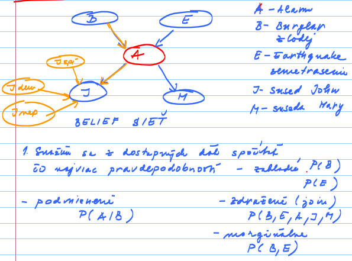

# OZNAL - Project 03 - Discrete Bayesian Networks

## FIIT STU - Bratislava

## May 2024

## Authors

-   Leonard Puškáč
-   Ema Richnáková

## Dataset

In this mini-project we will analyse data from <https://www.kaggle.com/datasets/julianoorlandi/spotify-top-songs-and-audio-features?resource=download>.

The dataset contains information about various "top" songs and their stats on Spotify.
There are 6513 entries each containing FILL IN features, such as the name of the song, its id, features that can be used to classify the songs such as the key or the mode (Major/Minor), as well as numeric features that can be used for regression analysis - energy, danceability, speechiness (the amount of spoken word), liveness, loudness, tempo and many others.

### Data Description

| Column name      | Description                                                                                                                                                                                                                                                                                                                                                                                                                                                                                                        |
|------------------|------------------------------------|
| id               | The Spotify ID for the track.                                                                                                                                                                                                                                                                                                                                                                                                                                                                                      |
| artist_names     | The name of the artist.                                                                                                                                                                                                                                                                                                                                                                                                                                                                                            |
| track_name       | The name of the track.                                                                                                                                                                                                                                                                                                                                                                                                                                                                                             |
| source           | The name of the record label.                                                                                                                                                                                                                                                                                                                                                                                                                                                                                      |
| key              | The key the track is in.                                                                                                                                                                                                                                                                                                                                                                                                                                                                                           |
| mode             | Mode indicates the modality (major or minor) of a track, the type of scale from which its melodic content is derived.                                                                                                                                                                                                                                                                                                                                                                                              |
| time_signature   | An estimated time signature. The time signature (meter) is a notational convention to specify how many beats are in each bar (or measure). The time signature ranges from 3 to 7.                                                                                                                                                                                                                                                                                                                                  |
| danceability     | Danceability describes how suitable a track is for dancing based on a combination of musical elements including tempo, rhythm stability, beat strength, and overall regularity. A value of 0.0 is least danceable and 1.0 is most danceable.                                                                                                                                                                                                                                                                       |
| energy           | Energy is a measure from 0.0 to 1.0 and represents a perceptual measure of intensity and activity. Typically, energetic tracks feel fast, loud, and noisy. For example, death metal has high energy, while a Bach prelude scores low on the scale. Perceptual features contributing to this attribute include dynamic range, perceived loudness, timbre, onset rate, and general entropy.                                                                                                                          |
| speechiness      | Speechiness detects the presence of spoken words in a track. The more exclusively speech-like the recording (e.g. talk show, audio book, poetry), the closer to 1.0 the attribute value. Values above 0.66 describe tracks that are probably made entirely of spoken words. Values between 0.33 and 0.66 describe tracks that may contain both music and speech, either in sections or layered, including such cases as rap music. Values below 0.33 most likely represent music and other non-speech-like tracks. |
| acousticness     | A confidence measure from 0.0 to 1.0 of whether the track is acoustic. 1.0 represents high confidence the track is acoustic.                                                                                                                                                                                                                                                                                                                                                                                       |
| instrumentalness | Predicts whether a track contains no vocals. "Ooh" and "aah" sounds are treated as instrumental in this context. Rap or spoken word tracks are clearly "vocal". The closer the instrumentalness value is to 1.0, the greater likelihood the track contains no vocal content. Values above 0.5 are intended to represent instrumental tracks, but confidence is higher as the value approaches 1.0.                                                                                                                 |
| liveness         | Detects the presence of an audience in the recording. Higher liveness values represent an increased probability that the track was performed live. A value above 0.8 provides strong likelihood that the track is live.                                                                                                                                                                                                                                                                                            |
| valence          | A measure from 0.0 to 1.0 describing the musical positiveness conveyed by a track. Tracks with high valence sound more positive (e.g. happy, cheerful, euphoric), while tracks with low valence sound more negative (e.g. sad, depressed, angry).                                                                                                                                                                                                                                                                  |
| loudness         | The overall loudness of a track in decibels (dB). Loudness values are averaged across the entire track and are useful for comparing relative loudness of tracks. Loudness is the quality of a sound that is the primary psychological correlate of physical strength (amplitude). Values typically range between -60 and 0 db.                                                                                                                                                                                     |
| tempo            | The overall estimated tempo of a track in beats per minute (BPM). In musical terminology, tempo is the speed or pace of a given piece and derives directly from the average beat duration.                                                                                                                                                                                                                                                                                                                         |
| duration_ms      | The duration of the track in milliseconds.                                                                                                                                                                                                                                                                                                                                                                                                                                                                         |
| weeks_on_chart   | Number of weeks the track was in the top 200 charts.                                                                                                                                                                                                                                                                                                                                                                                                                                                               |
| streams          | How many streams the track had during its period in the charts.                                                                                                                                                                                                                                                                                                                                                                                                                                                    |

## Importing Libraries

```{r message=FALSE}
library(tidyverse) # Pipe implementation for R
library(data.table) # Implements %like%
library(dplyr) # case_when
library(bnlearn) # Bayesian network
```

## Loading the Dataset

```{r message=FALSE}
data <- read_csv("spotify_top_songs_audio_features.csv", col_names = TRUE, num_threads = 4)
head(data)
```

## Data Exploration

We transform non-numeric features and conduct correlation analysis on the transformed data.

Following that, we select 7 suitable features.
We convert continuous values into discrete (using $0/1$ classification divided by $mean$) and use them to build a discrete Bayesian network.

```{r}
table(data$key)
table(data$mode)
table(data$time_signature)

numeric_data <- data %>%
    mutate(key = case_when(
        key %like% "A|A#/Bb" ~ 1,
        key %like% "B" ~ 2,
        key %like% "C|C#/Db" ~ 3,
        key %like% "D|D#/Eb" ~ 4,
        key %like% "E" ~ 5,
        key %like% "F|F#/Gb" ~ 6,
        key %like% "G|G#/Ab" ~ 7,
        .default = 0
    )) %>%
    mutate(mode = ifelse(mode == "Major", 1, 0)) %>%
    mutate(time_signature = ifelse(time_signature == "4 beats", 1, 0)) %>%
    select_if(is.numeric)

heatmap(cor(numeric_data),
        col = colorRampPalette(c("blue", "white", "red"))(100),
        symm = TRUE)

mean_dance <- mean(data$danceability) ; print(paste("Danceability mean: ", mean_dance))
mean_energy <- mean(data$energy) ; print(paste("Energy mean: ", mean_energy))
mean_valence <- mean(data$valence) ; print(paste("Valence mean: ", mean_valence))
mean_loud <- mean(data$loudness) ; print(paste("Loudness mean: ", mean_loud))
mean_tempo <- mean(data$tempo) ; print(paste("Tempo mean: ", mean_tempo))

discrete_data <- numeric_data %>%
    mutate(danceability = ifelse(danceability >= mean_dance, 1, 0)) %>%
    mutate(energy = ifelse(energy >= mean_energy, 1, 0)) %>%
    mutate(valence = ifelse(valence >= mean_valence, 1, 0)) %>%
    mutate(loudness = ifelse(loudness >= mean_loud, 1, 0)) %>%
    mutate(tempo = ifelse(tempo >= mean_tempo, 1, 0)) %>%
    select(mode, time_signature, danceability, energy, valence, loudness, tempo)
```

## Discrete Bayesian Network

```{r}
network_structure <- bnlearn::hc(discrete_data)
plot(network_structure)
```

| {width="50%"}                                              |
|:--------------------------------------------------------------------------------:|
| *Example of utilizing non-correlated feature such as 'key' in Bayesian network.* |

###  STORY treba, ktora vysvetli tu siet

TODO

### States

Our function `ratio_of` builds condition, which matches 1 value with 1 feature on same position.
Number of expressions in condition is equivalent to number of values/features.
This condition evaluates in `sum` function, which gives us number of rows which satisfies constructed condition.
This sum is divided by total number of rows in dataset, which gives as ratio of matched rows to all rows.
Essentially, it gives us propability of occurence for matched rows in dataset.

```{r}
ratio_of <- function(values, features) {
    num_values <- length(values)
    num_features <- length(features)

    if (num_values != num_features) {
        stop("The number of values must match the number of features.")
    }

    condition <- paste0(sapply(seq_len(num_values), function(i) paste0("features[[", i, "]] == values[", i, "]")), collapse = " & ")
    
    sum(eval(parse(text = condition))) / length(features[[1]])
}
```

|        |                             |                                                         |
|:------:|:---------------------------:|:-------------------------------------------------------:|
| $D$    |                             | $P(D)$                                                  |
| $d^+$  | Song is highly danceable.   | `r ratio_of(c(1), list(f1=discrete_data$danceability))` | 
| $d^-$  | Song is not very danceable. | `r ratio_of(c(0), list(f1=discrete_data$danceability))` |
|        |                             |                                                         |
| $E$    |                             | $P(E)$                                                  |   
| $e^+$  | Song is very energetic.     | `r ratio_of(c(1), list(discrete_data$energy))`          |
| $e^-$  | Song is not very energetic. | `r ratio_of(c(0), list(discrete_data$energy))`          |
|        |                             |                                                         |
| $L$    |                             | $P(L)$                                                  |
| $l^+$  | Song is louder.             | `r ratio_of(c(1), list(discrete_data$loudness))`        |
| $l^-$  | Song is soft.               | `r ratio_of(c(0), list(discrete_data$loudness))`        |
|        |                             |                                                         |
| $V$    |                             | $P(V)$                                                  |
| $v^+$  | Song is happy.              | `r ratio_of(c(1), list(discrete_data$valence))`         |
| $v^-$  | Song is sad.                | `r ratio_of(c(0), list(discrete_data$valence))`         |
|        |                             |                                                         |
| $M$    |                             | $P(M)$                                                  |
| $m^+$  | Song is in major mode.      | `r ratio_of(c(1), list(discrete_data$mode))`            | 
| $m^-$  | Song is in minor mode.      | `r ratio_of(c(0), list(discrete_data$mode))`            |
|        |                             |                                                         |
| $TS$   |                             | $P(TS)$                                                 |
| $ts^+$ | Song has 4 beats.           | `r ratio_of(c(1), list(discrete_data$time_signature))`  | 
| $ts^-$ | Song has 1,3 or 5 beats.    | `r ratio_of(c(0), list(discrete_data$time_signature))`  |
|        |                             |                                                         |
| $T$    |                             | $P(T)$                                                  |
| $t^+$  | Song is fast.               | `r ratio_of(c(1), list(discrete_data$tempo))`           |
| $t^-$  | Song is slow.               | `r ratio_of(c(0), list(discrete_data$tempo))`           |

### Questions

#### 1. What is the likelihood that a song has 4 beats, is in major mode, is very energetic, is louder, and is happy, all at the same time?

$P(TS,M,E,L,V)$ (join probability)

{width="30%"}

(*Child-Parent*)

$P(TS=ts^+,M=m^+,E=e^+,L=l^+,V=v^+) =$
$= P(TS=ts^+) * P(M=m^+) * P(E=e^+|M=m^+,TS=ts^+) * P(L=l^+|E=e^+) * P(V=v^+|E=e^+)$
$= 0.9299862 * 0.5753109 * 0,1533858 * 0,2302526 * 0,1781433$
$= 0,0033662$

a) $P(E=e^+|M=m^+,TS=ts^+) = \frac{P(E=e^+,M=m^+,TS=ts^+)}{P(M=m^+,TS=ts^+)} = 0.2866575 * 0.5350837 = 0,1533858$

    | E     | M     | TS     | $P(E,M,TS)$                                                                                        |
    |:-----:|:-----:|:------:|:--------------------------------------------------------------------------------------------------:|
    | $e^+$ | $m^+$ | $ts^+$ | `r ratio_of(c(1,1,1), list(discrete_data$energy,discrete_data$mode,discrete_data$time_signature))` |
    | $e^+$ | $m^+$ | $ts^-$ | `r ratio_of(c(1,1,0), list(discrete_data$energy,discrete_data$mode,discrete_data$time_signature))` |
    | $e^+$ | $m^-$ | $ts^+$ | `r ratio_of(c(1,0,1), list(discrete_data$energy,discrete_data$mode,discrete_data$time_signature))` |
    | $e^+$ | $m^-$ | $ts^-$ | `r ratio_of(c(1,0,0), list(discrete_data$energy,discrete_data$mode,discrete_data$time_signature))` |
    | $e^-$ | $m^+$ | $ts^+$ | `r ratio_of(c(0,1,1), list(discrete_data$energy,discrete_data$mode,discrete_data$time_signature))` |
    | $e^-$ | $m^+$ | $ts^-$ | `r ratio_of(c(0,1,0), list(discrete_data$energy,discrete_data$mode,discrete_data$time_signature))` |
    | $e^-$ | $m^-$ | $ts^+$ | `r ratio_of(c(0,0,1), list(discrete_data$energy,discrete_data$mode,discrete_data$time_signature))` |
    | $e^-$ | $m^-$ | $ts^-$ | `r ratio_of(c(0,0,0), list(discrete_data$energy,discrete_data$mode,discrete_data$time_signature))` |

    | M     | TS     | $P(M,TS)$                                                                   |
    |:-----:|:------:|:---------------------------------------------------------------------------:|
    | $m^+$ | $ts^+$ | `r ratio_of(c(1,1), list(discrete_data$mode,discrete_data$time_signature))` |
    | $m^+$ | $ts^-$ | `r ratio_of(c(1,0), list(discrete_data$mode,discrete_data$time_signature))` |
    | $m^-$ | $ts^+$ | `r ratio_of(c(0,1), list(discrete_data$mode,discrete_data$time_signature))` |
    | $m^-$ | $ts^-$ | `r ratio_of(c(0,0), list(discrete_data$mode,discrete_data$time_signature))` |

b) $P(L=l^+|E=e^+) = \frac{P(L=l^+,E=e^+)}{P(E=e^+)} = \frac{0.4294488}{0.5361585} = 0,2302526$

    | L     | E     | $P(L,E)$                                                                |
    |:-----:|:-----:|:-----------------------------------------------------------------------:|
    | $l^+$ | $e^+$ | `r ratio_of(c(1,1), list(discrete_data$loudness,discrete_data$energy))` |
    | $l^+$ | $e^-$ | `r ratio_of(c(1,0), list(discrete_data$loudness,discrete_data$energy))` |
    | $l^-$ | $e^+$ | `r ratio_of(c(0,1), list(discrete_data$loudness,discrete_data$energy))` |
    | $l^-$ | $e^-$ | `r ratio_of(c(0,0), list(discrete_data$loudness,discrete_data$energy))` |

c) $P(V=v^+|E=e^+) = \frac{P(V=v^+,E=e^+)}{P(E=e^+)} = \frac{0.3322586}{0.5361585} = 0,1781433$

    | V     | E     | $P(V,E)$                                                                |
    |:-----:|:-----:|:-----------------------------------------------------------------------:|
    | $v^+$ | $e^+$ | `r ratio_of(c(1,1), list(discrete_data$valence,discrete_data$energy))` |
    | $v^+$ | $e^-$ | `r ratio_of(c(1,0), list(discrete_data$valence,discrete_data$energy))` |
    | $v^-$ | $e^+$ | `r ratio_of(c(0,1), list(discrete_data$valence,discrete_data$energy))` |
    | $v^-$ | $e^-$ | `r ratio_of(c(0,0), list(discrete_data$valence,discrete_data$energy))` |

#### 2. What is the likelihood that a song has 4 beats and is fast?

$P(TS,T)$ (marginal probability)

$P(TS=ts^+,T=t^+)$

TODO asi trochu upravit tuto otazku aj matematicku formulku 🏎️

#### 3. If we know that a song is highly danceable and very energetic, what is the likelihood that it is happy?

$P(V|D,E)$ (conditional probability)

$P(V=v^+|D=d^+,E=e^+)$

#### 4. If we know that a song has 4 beats and is fast, what is the likelihood that it is highly danceable?

$P(D|TS,T)$ (conditional probability)

$P(D=d^+|TS=ts^+,T=t^+)$

#### 5. TODO

$P(???)$ (? probability)

$P(???)$ 

---

{width="50%"}

+sformulujte ich pomocou matematického vyjadrenia (join probability, marginal probability, conditional probability).

 - minimálne jednu join probability pre konkrétnu kombináciu dát napr. P(A=a+, B=b-, C=c+, D=d-,…) 
 - minimálne jednu marginálnu pravdepodobnosť napr. P(A,B,E) ak …C=c+ a D=d-
 - minimálne dve podmienenné pravdepodobnosti, ktoré musia zahŕňať podsieť s minimálne tromi na sebe závisiacimi javmi napr. P(A=a+| B=b+,C=c-)

 minimalne 2 odpovede na otazky (z toho aspoň jednu podmienenú TODO)
 - ak sa rozhodnete použiť niektorú z knižníc na výpočet pravdepodobností na sieti (nemusíte), tak formálne úpravy treba realizovať ručne a až numerický výsledok je možné zveriť knižnici
 
 Súčasťou projektu je výpis skriptu realizujúceho výpočet.
