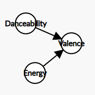

# OZNAL - Project 03 - Discrete Bayesian Networks

## FIIT STU - Bratislava

## May 2024

## Authors

-   Leonard Puškáč
-   Ema Richnáková

## Dataset

In this mini-project we will analyse data from <https://www.kaggle.com/datasets/julianoorlandi/spotify-top-songs-and-audio-features?resource=download>.

The dataset contains information about various "top" songs and their stats on Spotify. There are 6513 entries each containing FILL IN features, such as the name of the song, its id, features that can be used to classify the songs such as the key or the mode (Major/Minor), as well as numeric features that can be used for regression analysis - energy, danceability, speechiness (the amount of spoken word), liveness, loudness, tempo and many others.

### Data Description

| Column name      | Description                                                                                                                                                                                                                                                                                                                                                                                                                                                                                                        |
|-----------|-------------------------------------------------------------|
| id               | The Spotify ID for the track.                                                                                                                                                                                                                                                                                                                                                                                                                                                                                      |
| artist_names     | The name of the artist.                                                                                                                                                                                                                                                                                                                                                                                                                                                                                            |
| track_name       | The name of the track.                                                                                                                                                                                                                                                                                                                                                                                                                                                                                             |
| source           | The name of the record label.                                                                                                                                                                                                                                                                                                                                                                                                                                                                                      |
| key              | The key the track is in.                                                                                                                                                                                                                                                                                                                                                                                                                                                                                           |
| mode             | Mode indicates the modality (major or minor) of a track, the type of scale from which its melodic content is derived.                                                                                                                                                                                                                                                                                                                                                                                              |
| time_signature   | An estimated time signature. The time signature (meter) is a notational convention to specify how many beats are in each bar (or measure). The time signature ranges from 3 to 7.                                                                                                                                                                                                                                                                                                                                  |
| danceability     | Danceability describes how suitable a track is for dancing based on a combination of musical elements including tempo, rhythm stability, beat strength, and overall regularity. A value of 0.0 is least danceable and 1.0 is most danceable.                                                                                                                                                                                                                                                                       |
| energy           | Energy is a measure from 0.0 to 1.0 and represents a perceptual measure of intensity and activity. Typically, energetic tracks feel fast, loud, and noisy. For example, death metal has high energy, while a Bach prelude scores low on the scale. Perceptual features contributing to this attribute include dynamic range, perceived loudness, timbre, onset rate, and general entropy.                                                                                                                          |
| speechiness      | Speechiness detects the presence of spoken words in a track. The more exclusively speech-like the recording (e.g. talk show, audio book, poetry), the closer to 1.0 the attribute value. Values above 0.66 describe tracks that are probably made entirely of spoken words. Values between 0.33 and 0.66 describe tracks that may contain both music and speech, either in sections or layered, including such cases as rap music. Values below 0.33 most likely represent music and other non-speech-like tracks. |
| acousticness     | A confidence measure from 0.0 to 1.0 of whether the track is acoustic. 1.0 represents high confidence the track is acoustic.                                                                                                                                                                                                                                                                                                                                                                                       |
| instrumentalness | Predicts whether a track contains no vocals. "Ooh" and "aah" sounds are treated as instrumental in this context. Rap or spoken word tracks are clearly "vocal". The closer the instrumentalness value is to 1.0, the greater likelihood the track contains no vocal content. Values above 0.5 are intended to represent instrumental tracks, but confidence is higher as the value approaches 1.0.                                                                                                                 |
| liveness         | Detects the presence of an audience in the recording. Higher liveness values represent an increased probability that the track was performed live. A value above 0.8 provides strong likelihood that the track is live.                                                                                                                                                                                                                                                                                            |
| valence          | A measure from 0.0 to 1.0 describing the musical positiveness conveyed by a track. Tracks with high valence sound more positive (e.g. happy, cheerful, euphoric), while tracks with low valence sound more negative (e.g. sad, depressed, angry).                                                                                                                                                                                                                                                                  |
| loudness         | The overall loudness of a track in decibels (dB). Loudness values are averaged across the entire track and are useful for comparing relative loudness of tracks. Loudness is the quality of a sound that is the primary psychological correlate of physical strength (amplitude). Values typically range between -60 and 0 db.                                                                                                                                                                                     |
| tempo            | The overall estimated tempo of a track in beats per minute (BPM). In musical terminology, tempo is the speed or pace of a given piece and derives directly from the average beat duration.                                                                                                                                                                                                                                                                                                                         |
| duration_ms      | The duration of the track in milliseconds.                                                                                                                                                                                                                                                                                                                                                                                                                                                                         |
| weeks_on_chart   | Number of weeks the track was in the top 200 charts.                                                                                                                                                                                                                                                                                                                                                                                                                                                               |
| streams          | How many streams the track had during its period in the charts.                                                                                                                                                                                                                                                                                                                                                                                                                                                    |

## Importing Libraries

```{r message=FALSE}
library(tidyverse) # Pipe implementation for R
library(data.table) # Implements %like%
library(dplyr) # case_when
library(bnlearn) # Bayesian network
```

## Loading the Dataset

```{r message=FALSE}
data <- read_csv("spotify_top_songs_audio_features.csv", col_names = TRUE, num_threads = 4)
head(data)
```

## Data Exploration

We transform non-numeric features and conduct correlation analysis on the transformed data.

Following that, we select 7 suitable features. We convert continuous values into discrete (using $0/1$ classification divided by $mean$) and use them to build a discrete Bayesian network.

```{r}
table(data$key)
table(data$mode)
table(data$time_signature)

numeric_data <- data %>%
    mutate(key = case_when(
        key %like% "A|A#/Bb" ~ 1,
        key %like% "B" ~ 2,
        key %like% "C|C#/Db" ~ 3,
        key %like% "D|D#/Eb" ~ 4,
        key %like% "E" ~ 5,
        key %like% "F|F#/Gb" ~ 6,
        key %like% "G|G#/Ab" ~ 7,
        .default = 0
    )) %>%
    mutate(mode = ifelse(mode == "Major", 1, 0)) %>%
    mutate(time_signature = ifelse(time_signature == "4 beats", 1, 0)) %>%
    select_if(is.numeric)

heatmap(cor(numeric_data),
        col = colorRampPalette(c("blue", "white", "red"))(100),
        symm = TRUE)

mean_dance <- mean(data$danceability) ; print(paste("Danceability mean: ", mean_dance))
mean_energy <- mean(data$energy) ; print(paste("Energy mean: ", mean_energy))
mean_valence <- mean(data$valence) ; print(paste("Valence mean: ", mean_valence))
mean_loud <- mean(data$loudness) ; print(paste("Loudness mean: ", mean_loud))
mean_tempo <- mean(data$tempo) ; print(paste("Tempo mean: ", mean_tempo))

discrete_data <- numeric_data %>%
    mutate(danceability = ifelse(danceability >= mean_dance, 1, 0)) %>%
    mutate(energy = ifelse(energy >= mean_energy, 1, 0)) %>%
    mutate(valence = ifelse(valence >= mean_valence, 1, 0)) %>%
    mutate(loudness = ifelse(loudness >= mean_loud, 1, 0)) %>%
    mutate(tempo = ifelse(tempo >= mean_tempo, 1, 0)) %>%
    select(mode, time_signature, danceability, energy, valence, loudness, tempo)
```

## Discrete Bayesian Network

{width="60%"}\
*Example of utilizing non-correlated feature such as 'key' in Bayesian network.*

```{r}
network_structure <- bnlearn::hc(discrete_data)
plot(network_structure)
```

### The Story - Our interpretation of the Discrete Bayesian Network

As we can see, we used the bnlearn library to help us with the network construction. The library gave us useful pointers to see which variable depends upon which other variables. Here's how we can interpret it:

-   The tempo of the song dictates how danceable the song is (danceability).
-   The mode of the song (major or minor) also influences the danceability, but also determines the energy the song has.
-   The time-signature influences a lot of things - how danceable, loud and energetic the song is
-   The danceability of the song is a good predictor of the valance of the song
-   The overall energy of the song determines the valance and how loud it is
-   And finally the valance (or in other words how lively the song is) dictates how loud it is.

We concluded that the structure of the network does make simple logical sense, so we opted to use it further and, with it, answer the questions we constructed in the next steps.

### States

Our function `ratio_of` builds condition, which matches 1 value with 1 feature on same position. The number of expressions in the condition is equivalent to the number of values/features. This condition evaluates in the `sum` function, which gives us the number of rows which satisfies the constructed condition. This sum is divided by the total number of rows in the dataset, which gives us the ratio of the matched rows to the total number of rows. Essentially, it gives us the probability of occurence for matched rows in the dataset.

```{r}
ratio_of <- function(values, features) {
    num_values <- length(values)
    num_features <- length(features)

    if (num_values != num_features) {
        stop("The number of values must match the number of features.")
    }

    condition <- paste0(sapply(seq_len(num_values), function(i) paste0("features[[", i, "]] == values[", i, "]")), collapse = " & ")
    
    sum(eval(parse(text = condition))) / length(features[[1]])
}
```

|        |                             |                                                         |
|:-------------:|:-----------------:|:-------------------------------------:|
|  $D$   |                             |                         $P(D)$                          |
| $d^+$  |  Song is highly danceable.  | `r ratio_of(c(1), list(f1=discrete_data$danceability))` |
| $d^-$  | Song is not very danceable. | `r ratio_of(c(0), list(f1=discrete_data$danceability))` |
|        |                             |                                                         |
|  $E$   |                             |                         $P(E)$                          |
| $e^+$  |   Song is very energetic.   |     `r ratio_of(c(1), list(discrete_data$energy))`      |
| $e^-$  | Song is not very energetic. |     `r ratio_of(c(0), list(discrete_data$energy))`      |
|        |                             |                                                         |
|  $L$   |                             |                         $P(L)$                          |
| $l^+$  |       Song is louder.       |    `r ratio_of(c(1), list(discrete_data$loudness))`     |
| $l^-$  |        Song is soft.        |    `r ratio_of(c(0), list(discrete_data$loudness))`     |
|        |                             |                                                         |
|  $V$   |                             |                         $P(V)$                          |
| $v^+$  |       Song is happy.        |     `r ratio_of(c(1), list(discrete_data$valence))`     |
| $v^-$  |        Song is sad.         |     `r ratio_of(c(0), list(discrete_data$valence))`     |
|        |                             |                                                         |
|  $M$   |                             |                         $P(M)$                          |
| $m^+$  |   Song is in major mode.    |      `r ratio_of(c(1), list(discrete_data$mode))`       |
| $m^-$  |   Song is in minor mode.    |      `r ratio_of(c(0), list(discrete_data$mode))`       |
|        |                             |                                                         |
|  $TS$  |                             |                         $P(TS)$                         |
| $ts^+$ |      Song has 4 beats.      | `r ratio_of(c(1), list(discrete_data$time_signature))`  |
| $ts^-$ |  Song has 1,3 or 5 beats.   | `r ratio_of(c(0), list(discrete_data$time_signature))`  |
|        |                             |                                                         |
|  $T$   |                             |                         $P(T)$                          |
| $t^+$  |        Song is fast.        |      `r ratio_of(c(1), list(discrete_data$tempo))`      |
| $t^-$  |        Song is slow.        |      `r ratio_of(c(0), list(discrete_data$tempo))`      |

### Questions

#### 1. What is the likelihood that a song has 4 beats, is in major mode, is very energetic, is louder, and is happy, all at the same time?

$P(TS,M,E,L,V)$ (join probability)

{width="30%"}

(*Child-Parent*)

$P(TS=ts^+,M=m^+,E=e^+,L=l^+,V=v^+) =$ $= P(TS=ts^+) * P(M=m^+) * P(E=e^+|M=m^+,TS=ts^+) * P(L=l^+|E=e^+) * P(V=v^+|E=e^+)$ $= 0.9299862 * 0.5753109 * 0,1533858 * 0,2302526 * 0,1781433$ $= 0,0033662$

a)  $P(E=e^+|M=m^+,TS=ts^+) = \frac{P(E=e^+,M=m^+,TS=ts^+)}{P(M=m^+,TS=ts^+)} = 0.2866575 * 0.5350837 = 0,1533858$

    |   E   |   M   |   TS   |                                            $P(E,M,TS)$                                             |
    |:-------:|:-------:|:-------:|:---------------------------------------------:|
    | $e^+$ | $m^+$ | $ts^+$ | `r ratio_of(c(1,1,1), list(discrete_data$energy,discrete_data$mode,discrete_data$time_signature))` |
    | $e^+$ | $m^+$ | $ts^-$ | `r ratio_of(c(1,1,0), list(discrete_data$energy,discrete_data$mode,discrete_data$time_signature))` |
    | $e^+$ | $m^-$ | $ts^+$ | `r ratio_of(c(1,0,1), list(discrete_data$energy,discrete_data$mode,discrete_data$time_signature))` |
    | $e^+$ | $m^-$ | $ts^-$ | `r ratio_of(c(1,0,0), list(discrete_data$energy,discrete_data$mode,discrete_data$time_signature))` |
    | $e^-$ | $m^+$ | $ts^+$ | `r ratio_of(c(0,1,1), list(discrete_data$energy,discrete_data$mode,discrete_data$time_signature))` |
    | $e^-$ | $m^+$ | $ts^-$ | `r ratio_of(c(0,1,0), list(discrete_data$energy,discrete_data$mode,discrete_data$time_signature))` |
    | $e^-$ | $m^-$ | $ts^+$ | `r ratio_of(c(0,0,1), list(discrete_data$energy,discrete_data$mode,discrete_data$time_signature))` |
    | $e^-$ | $m^-$ | $ts^-$ | `r ratio_of(c(0,0,0), list(discrete_data$energy,discrete_data$mode,discrete_data$time_signature))` |

    |   M   |   TS   |                                  $P(M,TS)$                                  |
    |:---------:|:---------:|:-------------------------------------------------:|
    | $m^+$ | $ts^+$ | `r ratio_of(c(1,1), list(discrete_data$mode,discrete_data$time_signature))` |
    | $m^+$ | $ts^-$ | `r ratio_of(c(1,0), list(discrete_data$mode,discrete_data$time_signature))` |
    | $m^-$ | $ts^+$ | `r ratio_of(c(0,1), list(discrete_data$mode,discrete_data$time_signature))` |
    | $m^-$ | $ts^-$ | `r ratio_of(c(0,0), list(discrete_data$mode,discrete_data$time_signature))` |

b)  $P(L=l^+|E=e^+) = \frac{P(L=l^+,E=e^+)}{P(E=e^+)} = \frac{0.4294488}{0.5361585} = 0,2302526$

    |   L   |   E   |                                $P(L,E)$                                 |
    |:---------:|:---------:|:-------------------------------------------------:|
    | $l^+$ | $e^+$ | `r ratio_of(c(1,1), list(discrete_data$loudness,discrete_data$energy))` |
    | $l^+$ | $e^-$ | `r ratio_of(c(1,0), list(discrete_data$loudness,discrete_data$energy))` |
    | $l^-$ | $e^+$ | `r ratio_of(c(0,1), list(discrete_data$loudness,discrete_data$energy))` |
    | $l^-$ | $e^-$ | `r ratio_of(c(0,0), list(discrete_data$loudness,discrete_data$energy))` |

c)  $P(V=v^+|E=e^+) = \frac{P(V=v^+,E=e^+)}{P(E=e^+)} = \frac{0.3322586}{0.5361585} = 0,1781433$

    |   V   |   E   |                                $P(V,E)$                                |
    |:---------:|:---------:|:-------------------------------------------------:|
    | $v^+$ | $e^+$ | `r ratio_of(c(1,1), list(discrete_data$valence,discrete_data$energy))` |
    | $v^+$ | $e^-$ | `r ratio_of(c(1,0), list(discrete_data$valence,discrete_data$energy))` |
    | $v^-$ | $e^+$ | `r ratio_of(c(0,1), list(discrete_data$valence,discrete_data$energy))` |
    | $v^-$ | $e^-$ | `r ratio_of(c(0,0), list(discrete_data$valence,discrete_data$energy))` |

#### 2. What is the likelihood that a song has 4 beats?

Marginal probability is supposed to express the probability of an event within one of the features occurring irregardless of the state of the other features. In other words, what is the likelihood of a state of a variable in isolation?

This is already predefined

In this case we ask the question "What is the likelihood that a song has 4 beats?" or:

$P(TS=ts^+)$ (marginal probability)

$P(TS=ts^+) = 0.9299862$

|        |                          |                                                        |
|:-------------:|:---------------:|:--------------------------------------:|
|  $TS$  |                          |                        $P(TS)$                         |
| $ts^+$ |    Song has 4 beats.     | `r ratio_of(c(1), list(discrete_data$time_signature))` |
| $ts^-$ | Song has 1,3 or 5 beats. | `r ratio_of(c(0), list(discrete_data$time_signature))` |

#### 3. If we know that a song is highly danceable and very energetic, what is the likelihood that it is happy?

{width="30%"}

$P(V|D,E)$ (conditional probability)

$P(V=v^+|D=d^+,E=e^+)$

$P(V=v^+|D=d^+,E=e^+) = \frac{P(V=v^+,D=d^+,E=e^+)}{P(D=d^+,E=e^+)} = \frac{0.2174113}{0.3003224} = 0.7239263$

|   V   |   D   |   E   |                                             $P(V,D,E)$                                              |
|:-------:|:-------:|:-------:|:---------------------------------------------:|
| $v^+$ | $d^+$ | $e^+$ | `r ratio_of(c(1,1,1), list(discrete_data$valence,discrete_data$danceability,discrete_data$energy))` |
| $v^+$ | $d^+$ | $e^-$ | `r ratio_of(c(1,1,0), list(discrete_data$valence,discrete_data$danceability,discrete_data$energy))` |
| $v^+$ | $d^-$ | $e^+$ | `r ratio_of(c(1,0,1), list(discrete_data$valence,discrete_data$danceability,discrete_data$energy))` |
| $v^+$ | $d^-$ | $e^-$ | `r ratio_of(c(1,0,0), list(discrete_data$valence,discrete_data$danceability,discrete_data$energy))` |
| $v^-$ | $d^+$ | $e^+$ | `r ratio_of(c(0,1,1), list(discrete_data$valence,discrete_data$danceability,discrete_data$energy))` |
| $v^-$ | $d^+$ | $e^-$ | `r ratio_of(c(0,1,0), list(discrete_data$valence,discrete_data$danceability,discrete_data$energy))` |
| $v^-$ | $d^-$ | $e^+$ | `r ratio_of(c(0,0,1), list(discrete_data$valence,discrete_data$danceability,discrete_data$energy))` |
| $v^-$ | $d^-$ | $e^-$ | `r ratio_of(c(0,0,0), list(discrete_data$valence,discrete_data$danceability,discrete_data$energy))` |

|   D   |   E   |                                  $P(D,E)$                                   |
|:---------:|:---------:|:-------------------------------------------------:|
| $d^+$ | $e^+$ | `r ratio_of(c(1,1), list(discrete_data$danceability,discrete_data$energy))` |
| $d^+$ | $e^-$ | `r ratio_of(c(1,0), list(discrete_data$danceability,discrete_data$energy))` |
| $d^-$ | $e^+$ | `r ratio_of(c(0,1), list(discrete_data$danceability,discrete_data$energy))` |
| $d^-$ | $e^-$ | `r ratio_of(c(0,0), list(discrete_data$danceability,discrete_data$energy))` |

#### 4. If we know that a song has 4 beats and is fast, what is the likelihood that it is highly danceable?

{width="30%"}

$P(D|TS,T)$ (conditional probability)

$P(D=d^+|TS=ts^+,T=t^+) = \frac{P(D=d^+,TS=ts^+,T=t^+)}{P(TS=ts^+,T=t^+)} = \frac{0.2335329}{0.4363581} = 0.5351863$

|   D   |   TS   |   T   |                                                $P(D,TS,T)$                                                |
|:------:|:------:|:------:|:---------------------------------------------:|
| $d^+$ | $ts^+$ | $t^+$ | `r ratio_of(c(1,1,1), list(discrete_data$danceability,discrete_data$time_signature,discrete_data$tempo))` |
| $d^+$ | $ts^+$ | $t^-$ | `r ratio_of(c(1,1,0), list(discrete_data$danceability,discrete_data$time_signature,discrete_data$tempo))` |
| $d^+$ | $ts^-$ | $t^+$ | `r ratio_of(c(1,0,1), list(discrete_data$danceability,discrete_data$time_signature,discrete_data$tempo))` |
| $d^+$ | $ts^-$ | $t^-$ | `r ratio_of(c(1,0,0), list(discrete_data$danceability,discrete_data$time_signature,discrete_data$tempo))` |
| $d^-$ | $ts^+$ | $t^+$ | `r ratio_of(c(0,1,1), list(discrete_data$danceability,discrete_data$time_signature,discrete_data$tempo))` |
| $d^-$ | $ts^+$ | $t^-$ | `r ratio_of(c(0,1,0), list(discrete_data$danceability,discrete_data$time_signature,discrete_data$tempo))` |
| $d^-$ | $ts^-$ | $t^+$ | `r ratio_of(c(0,0,1), list(discrete_data$danceability,discrete_data$time_signature,discrete_data$tempo))` |
| $d^-$ | $ts^-$ | $t^-$ | `r ratio_of(c(0,0,0), list(discrete_data$danceability,discrete_data$time_signature,discrete_data$tempo))` |

|   TS   |   T   |                                  $P(TS,T)$                                   |
|:---------:|:---------:|:-------------------------------------------------:|
| $ts^+$ | $t^+$ | `r ratio_of(c(1,1), list(discrete_data$time_signature,discrete_data$tempo))` |
| $ts^+$ | $t^-$ | `r ratio_of(c(1,0), list(discrete_data$time_signature,discrete_data$tempo))` |
| $ts^-$ | $t^+$ | `r ratio_of(c(0,1), list(discrete_data$time_signature,discrete_data$tempo))` |
| $ts^-$ | $t^-$ | `r ratio_of(c(0,0), list(discrete_data$time_signature,discrete_data$tempo))` |

#### 5. What is the probability that the song has high loudness while it has low energy and is in major mode?

{width="30%"}

$P(L=l^+|E=e^-,M=m^+)$ (conditional probability)

This conditional question deals with two variables that we know the state of, and one of them influences the other (specifically, there is a causal relationship between mode and energy, where the energy is influenced by the mode - we can see this in the network - there is a directed edge from mode to energy). Then there is a directed edge from energy to loudness. We are interested in knowing what the state of loudness would be given that mode is in one state and energy is as well.

We can then see, that based on the formula resulting from the BN, that we can entirely remove the dependence of loudness from the mode. We can see that here:

$P(L=l^+|E=e^-,M=m^+) = \frac{P(M=m^+).P(E=e^-|M=m^+).P(L=l^+|E=e^-)}{P(M=m^+).P(E=e^-|M=m^+)} = \frac{P(L=l+|E=e-)}{1} = \frac{P(L=l^+,E=e^-)}{P(E=e^-)} = \frac{0.1325042}{0.4638415} = 0.2856669$

|   L   |   E   |                                $P(L, E)$                                |
|:---------:|:---------:|:-------------------------------------------------:|
| $l^+$ | $e^+$ | `r ratio_of(c(1,1), list(discrete_data$loudness,discrete_data$energy))` |
| $l^+$ | $e^-$ | `r ratio_of(c(1,0), list(discrete_data$loudness,discrete_data$energy))` |
| $l^-$ | $e^+$ | `r ratio_of(c(0,1), list(discrete_data$loudness,discrete_data$energy))` |
| $l^-$ | $e^-$ | `r ratio_of(c(0,0), list(discrete_data$loudness,discrete_data$energy))` |
